<p align="center">
  
  
  
  
</p>

# 🚦 AI Traffic — Интеллектуальная система мониторинга и прогнозирования дорожного трафика

> **Дипломный проект** — ЕНУ им. Л.Н. Гумилева, IT Department, 2026  
> **Автор:** Сулейменов Алишер  
> **Научный руководитель:** Кусаинова Айнур

---

## 🌐 Ссылки

| Ресурс | URL |
|---|---|
| 🌍 **Сайт проекта** | [alishoksu-coder.github.io/ai_traffics](https://alishoksu-coder.github.io/ai_traffics/) |
| 🎞️ **Презентация** | [presentation.html](https://alishoksu-coder.github.io/ai_traffics/presentation.html) |
| 🗺️ **Live-карта** | [map.html](https://alishoksu-coder.github.io/ai_traffics/website/map.html) |
| 🛡️ **Админ-панель** | [admin.html](https://alishoksu-coder.github.io/ai_traffics/website/admin.html) |
| 📦 **GitHub** | [github.com/alishoksu-coder/ai_traffics](https://github.com/alishoksu-coder/ai_traffics) |

---

## 📖 О проекте

**AI Traffic** — кешенді интеллектуалды жүйе, қалалық ортадағы көлік ағындарын нақты уақытта бақылау мен LSTM нейрондық желісі арқылы болжауға арналған.

### Ключевые возможности

- 🧠 **LSTM нейросеть** — прогнозирование трафика с точностью 87.4%
- 📊 **Z-Score детекция** — автоматическое обнаружение аномалий и ДТП
- 🗺️ **Интерактивная карта** — 144 точки мониторинга по Астане (район Есиль)
- 📱 **Мобильное приложение** — Flutter + Google Maps SDK
- ⚡ **Real-time данные** — WebSocket обновления каждые 30 секунд
- 🔐 **Безопасность** — FaceID, TouchID, PIN-код, AES-256 шифрование
- ♿ **Инклюзивный маршрут** — безбарьерная навигация для людей с ОВЗ

---

## 🏗️ Архитектура

```
┌─────────────────┐     ┌──────────────────┐     ┌─────────────────┐
│   📱 Mobile     │────▶│   ⚡ Backend     │────▶│   🧠 AI/Data    │
│   Flutter/Dart  │     │   FastAPI/Python  │     │   LSTM/PyTorch  │
│   Google Maps   │◀────│   WebSocket      │◀────│   PostgreSQL    │
└─────────────────┘     └──────────────────┘     └─────────────────┘
        │                       │
        ▼                       ▼
┌─────────────────┐     ┌──────────────────┐
│   🌐 Website    │     │   🛡️ Admin Panel │
│   Landing Page  │     │   Vue.js Monitor │
└─────────────────┘     └──────────────────┘
```

---

## 📱 Функциональная диаграмма приложения

```mermaid
flowchart TD
    A["🚀 Splash Screen"] --> B["🔐 Аутентификация"]
    B --> B1["FaceID / TouchID"]
    B --> B2["PIN-код"]
    B --> B3["Админ-логин"]
    
    B1 & B2 --> C["🏠 Главный экран"]
    B3 --> ADM["🛡️ Админ-панель"]

    C --> T1["🗺️ Карта"]
    C --> T2["🧭 Навигатор"]
    C --> T3["🚗 Режим вождения"]
    C --> T4["📊 Метрики"]
    C --> T5["⚙️ Ещё"]

    T1 --> T1a["Тепловая карта трафика"]
    T1 --> T1b["144 точки мониторинга"]
    T1 --> T1c["Цветовая индикация загруженности"]
    T1 --> T1d["Кастомные маркеры"]

    T2 --> T2a["🔍 Поиск маршрута A→B"]
    T2 --> T2b["♿ Инклюзивный маршрут"]
    T2 --> T2c["🎤 Голосовой ввод"]
    T2 --> T2d["⏱️ ETA с учётом трафика"]
    T2 --> T2e["🧠 AI-рекомендации"]

    T3 --> T3a["GPS-трекинг в реальном времени"]
    T3 --> T3b["Спидометр"]
    T3 --> T3c["Пошаговые подсказки"]
    T3 --> T3d["Антистресс-режим"]

    T4 --> T4a["LSTM прогноз загруженности"]
    T4 --> T4b["Графики трафика"]
    T4 --> T4c["Z-Score аномалии"]
    T4 --> T4d["Погодное влияние"]

    T5 --> T5a["👥 Друзья"]
    T5 --> T5b["💡 Советы"]
    T5 --> T5c["🔒 Настройки безопасности"]
    T5 --> T5d["🌙 Тёмная тема"]
    T5 --> T5e["📡 Сегменты дорог"]

    ADM --> ADM1["Мониторинг всех сегментов"]
    ADM --> ADM2["Управление инцидентами"]
    ADM --> ADM3["Статистика и отчёты"]

    style A fill:#3b82f6,color:#fff,stroke:none
    style B fill:#7c3aed,color:#fff,stroke:none
    style C fill:#2563eb,color:#fff,stroke:none
    style ADM fill:#ef4444,color:#fff,stroke:none
    style T1 fill:#10b981,color:#fff,stroke:none
    style T2 fill:#f59e0b,color:#fff,stroke:none
    style T3 fill:#06b6d4,color:#fff,stroke:none
    style T4 fill:#8b5cf6,color:#fff,stroke:none
    style T5 fill:#64748b,color:#fff,stroke:none
```



---

## 🛠️ Технологии

| Слой | Технологии |
|---|---|
| **Backend** | Python 3.10, FastAPI, Uvicorn, Pydantic, WebSockets |
| **AI/ML** | PyTorch (LSTM), Scikit-learn (Random Forest), NumPy, Pandas |
| **Database** | PostgreSQL + PostGIS, SQLite (dev) |
| **Mobile** | Flutter 3.x, Dart, Google Maps SDK, Provider |
| **Web** | HTML5, CSS3, JavaScript, Leaflet.js, Chart.js |
| **DevOps** | Docker, GitHub Actions, GitHub Pages |

---

## 🚀 Быстрый старт

### Backend (Python 3.10, Windows)

```powershell
cd backend
py -3.10 -m venv .venv
.\.venv\Scripts\Activate.ps1
pip install -r requirements.txt
uvicorn app.main:app --host 0.0.0.0 --port 8000 --reload
```

> При первом запуске автоматически создаётся сетка из **144 локаций** по всей Астане.  
> Для пересоздания удалите `backend/data/traffic.db` и перезапустите.

### Mobile (Flutter)

```powershell
# 1. Убедитесь что Flutter SDK и Android SDK установлены
# 2. Подключите телефон по USB (включите USB Debugging)
# 3. Настройте IP-адрес сервера:

# Откройте mobile/traffic_app/lib/config.dart
# Установите: baseUrl = "http://<ваш_IP>:8000"

cd mobile/traffic_app
flutter pub get
flutter run
```

### API Документация

После запуска backend, откройте:
- 📗 **Swagger UI:** `http://localhost:8000/docs`
- 📘 **ReDoc:** `http://localhost:8000/redoc`

---

## 📊 Результаты ML-модели

| Модель | MAE | RMSE | Accuracy |
|---|---|---|---|
| Linear Regression | 0.18 | 0.24 | 72.1% |
| Random Forest | 0.11 | 0.16 | 81.5% |
| **LSTM (выбранная)** | **0.08** | **0.12** | **87.4%** |

---

## 📂 Структура проекта

```
ai_traffic_fullstack/
├── backend/                  # FastAPI сервер
│   ├── app/
│   │   ├── main.py           # Главный API сервер
│   │   ├── simulate.py       # Симулятор трафика
│   │   ├── predict.py        # ML предсказания
│   │   ├── lstm_engine.py    # LSTM модель
│   │   └── weather.py        # Погодные данные
│   ├── data/                 # БД и модели
│   └── requirements.txt
├── mobile/                   # Flutter приложение
│   └── traffic_app/
│       └── lib/
│           ├── main.dart
│           ├── map_screen.dart
│           ├── drive_screen.dart
│           └── ...
├── website/                  # Веб-интерфейс
│   ├── index.html            # Landing page
│   ├── map.html              # Интерактивная карта
│   ├── admin.html            # Админ-панель
│   └── style.css
├── presentation.html         # Reveal.js презентация (с редактором)
└── README.md
```

---

## 🎞️ Презентация

Интерактивная презентация на **Reveal.js** с встроенной панелью управления:

- ✏️ **Режим редактирования** — кликай и правь текст прямо на слайде
- 📄 **Экспорт в PDF** — скачай в один клик
- 📊 **Экспорт в PPTX** — скачай как PowerPoint файл
- 🔢 **Счётчик слайдов** — навигация по номерам

👉 [Открыть презентацию](https://alishoksu-coder.github.io/ai_traffics/presentation.html)

---

## 📝 Лицензия

Дипломный проект ЕНУ им. Л.Н. Гумилева © 2026 Сулейменов Алишер

---

<p align="center">
  <strong>🇰🇿 Made in Kazakhstan</strong>
</p>